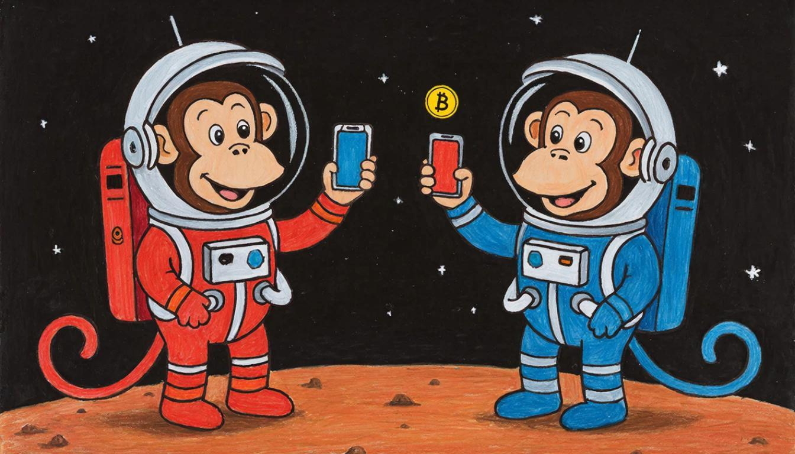

# Bingo-Bongo Protocol

Offline payment authorization with deferred settlement.

> Bingo and Bongo are two monkeys on Mars.  
> There is no internet.  
> They still need to pay.

<strong>Contents</strong>

- [Bingo-Bongo Protocol](#bingo-bongo-protocol)
  - [TL;DR](#tldr)
  - [Motivation](#motivation)
  - [Core Idea](#core-idea)
  - [Roles \& Terminology](#roles--terminology)
  - [What This Protocol Is NOT](#what-this-protocol-is-not)
  - [Threat model (high level)](#threat-model-high-level)
    - [Assumptions](#assumptions)
    - [Primary risks](#primary-risks)
    - [Mitigations](#mitigations)
  - [High-level architecture](#high-level-architecture)
  - [Voucher overview](#voucher-overview)
  - [Overview of the settlement](#overview-of-the-settlement)
  - [Use cases](#use-cases)
  - [Status](#status)
  - [Design Philosophy](#design-philosophy)
  - [Disclaimer](#disclaimer)
  - [License](#license)

## TL;DR

**Bingo-Bongo Protocol** enables two devices to authorize a payment
while offline (via NFC or Bluetooth), and settle it later once network
connectivity is restored.

- Offline-first payment authorization
- Cryptographically signed commitments (vouchers)
- Risk-limited by design
- Compatible with Account Abstraction (ERC-4337)

This protocol is designed as an **offline fallback**, not a replacement
for online payment systems.

## Motivation

Internet connectivity is not always available.

In many environments — emerging markets, large events, transportation,
or during network outages — mobile payments fail simply because devices
cannot reach the network.

Most crypto payment systems require:

- always-on connectivity
- immediate access to global state
- real-time transaction submission

**Bingo-Bongo Protocol** separates payment authorization from settlement,
allowing payments to be agreed upon offline and finalized later.

## Core Idea

The protocol splits a payment into two phases:

1. **Offline authorization**
2. **Online settlement**
3. **Instant crypto acquiring SDK with deferred settlement**

While offline:

1. Bingo (payer) signs a payment commitment (voucher)
2. Bongo (recipient) verifies and stores the voucher locally

Once either party is online:

3. The voucher is submitted for settlement
4. Funds are transferred on-chain

## Roles & Terminology

- **Bingo** — the payer authorizing a payment
- **Bongo** — the recipient collecting authorization
- **Voucher** — a signed offline payment commitment
- **Settlement** — execution of the voucher on a settlement layer
- **Offline limit** — maximum value that can be authorized while offline

## What This Protocol Is NOT

To set correct expectations, Bingo-Bongo is:

- ❌ Not fully trustless offline money
- ❌ Not infinite offline spending
- ❌ Not a replacement for Visa, Apple Pay, or online crypto payments
- ❌ Not designed for large-value transfers

The protocol intentionally trades off full trustlessness for usability in offline environments.

## Threat model (high level)

### Assumptions

- Devices can remain offline for a limited time.
- One of the parties may behave maliciously
- Network connection will be restored over time.

### Primary risks

- Attempts to double spend while offline
- Repeat previously signed vouchers
- Lost or compromised device

### Mitigations

- Clear restrictions on offline spending
- Disposable numbers per voucher
- Expiration timestamps
- Deterministic on-chain verification

## High-level architecture

The protocol consists of the following components:

- **Mobile SDK**
  - NFC for discoveries
  - Bluetooth for data transfer
- **Voucher format**
  - Structured signed message (EIP-712 compatible).
- **Smart account**
  - Account abstraction compliant with ERC-4337.
- **Relayer/Bandler**
  - Sends settlement transactions online.

ERC-4337 is used internally to provide flexible verification.
custom nonce management and gas abstraction.

## Voucher overview

The voucher represents an authorized offline payment.

At a minimum, it contains:

- payer's address (Bingo)
- recipient's address (Bongo)
- asset identifier
- amount
- unique one-time number
- expiration timestamp
- cryptographic signature

Vouchers are one-time use and become invalid once paid for or expired.

## Overview of the settlement

When the connection is restored:

1. The voucher is transferred to the settlement level.
2. The payer’s smart account checks:
   - signature
   - one-time uniqueness
   - validity period
   - available offline balance
3. Funds are transferred
4. The voucher is permanently marked as used.

Settlement can be initiated by either party or a third party relay.

## Use cases

- Autonomous payments to sellers
- Events and festivals with congested networks
- Developing markets with unstable connections
- Backup of the payment system during failures
- Phone to phone payments without POS equipment

## Status

**Current Status:** Concept/Early PoC

Planned stages:

- Voucher specification v0.1
- Reference smart account ERC-4337.
- Mobile SDK prototype
- Comprehensive demo with two devices

## Design Philosophy

The Bingo-Bongo protocol is built on obvious compromises:

- Limited risk instead of unlimited trust
- Delay of settlement rather than immediate finality
- Simplicity over protocol maximalism

Offline payments are not free.
This protocol clearly defines cost and risk.

## Disclaimer

This project is experimental.

It is not intended for production use without
proper safety checks, risk assessments,
and normative consideration.

## License

TBD
